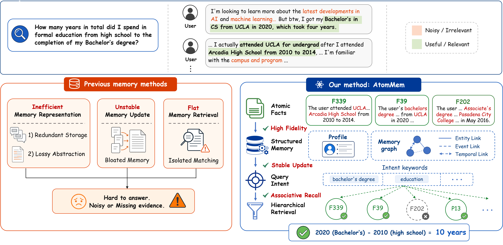
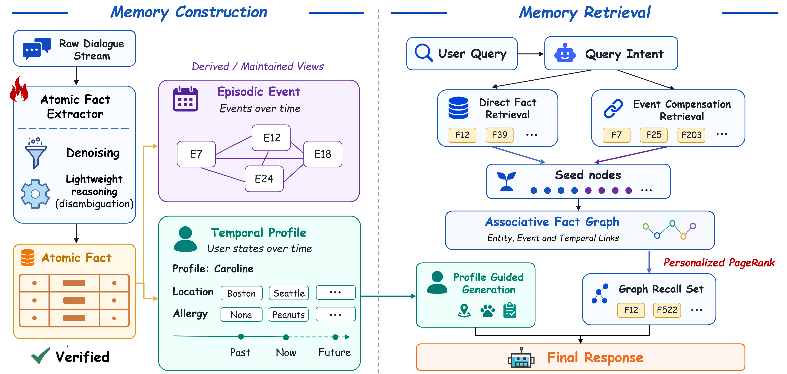
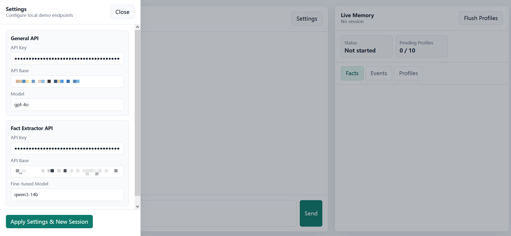

# 🧠 AtomMem: Building Simple and Effective Memory System for LLM Agents via Atomic Facts

**AtomMem** is a long-term memory system designed for personalized LLM agents. It leverages **atomic facts** as a highly efficient memory representation to distill continuous dialogue history into self-contained, information-dense units. Building upon this foundation, it incrementally constructs **event memories** to capture coherent episodic context and **temporal user profiles** to track dynamically evolving user attributes. At inference time, it retrieves highly relevant evidence through a dynamic **associative memory graph**. This holistic architecture ensures stable memory evolution, ultimately providing a scalable and economically viable solution for deploying intelligent personalized agents.

---

## ✨ Key Features

* 🧩 **Tri-partite Memory Architecture**: Maintains three distinct memory views: self-contained, information-dense **Atomic Facts**, episodic **Event Memories**, and evolving **Temporal User Profiles**.
* 🕸️ **Associative Graph Retrieval**: Utilizes a localized memory graph (Entities, Events, and Neighboring Dialogue Turns) and applies Random Walk with Restart (RWR) to surface implicit contextual evidence.
* ⚡ **Plug-and-Play Pipeline**: Acts as a highly adaptable memory module and allows developers to effortlessly equip conversational agents with long-term memory capabilities to deliver personalized services.

<p align="center">
  <br>
  <sub><b>Architecture comparison.</b> AtomMem overcomes the bloated storage and isolated matching of previous methods <br> by organizing atomic facts into associative graphs for precise hierarchical retrieval.</sub>
</p>

---


## 🏗️ System Architecture

During the memory construction phase, AtomMem distills continuous dialogue history into self-contained, information-dense atomic facts, which are then used to incrementally build coherent event memories and track temporal user profiles. At QA time, AtomMem retrieves a high-precision seed set, activates a localized memory graph connecting entities, events, and neighboring dialogue turns, and propagates activation scores via Personalized PageRank (PPR) to identify the optimal context.

<p align="center">
  <br>
  <sub><b>The overall architecture of AtomMem.</b> It is designed to support high-density memory storage, stable user-state evolution, and efficient retrieval for long-term personalized agents.</sub>
</p>

## 📂 Repository Layout

```text
.
├── atommem_core/              # Pipeline components
├── data/                      # Fact Extractor SFT training data and LoCoMo benchmark dataset
├── prompts/                   # LLM prompts used by memory construction and QA
├── scripts/                   # Execution and evaluation scripts
├── src/                       # Underlying modules for storage, retrieval, LLMs, and embeddings
├── config.py                  # Environment-driven settings
├── .env.example
└── requirements.txt
```

## 🚀 Getting Started

1. Installation

```bash
python -m venv .venv
source .venv/bin/activate
pip install -r requirements.txt
```

On Windows PowerShell:

```powershell
python -m venv .venv
.\.venv\Scripts\Activate.ps1
pip install -r requirements.txt
```

2. Configuration
Create your environment file and configure your LLM / Embedding endpoints. config.py contains no API keys; all credentials must be supplied via the environment.

```bash
cp .env.example .env
```

Edit `.env`:

```bash
ATOMMEM_API_KEY=your_api_key_here
ATOMMEM_API_BASE=https://api.openai.com/v1
ATOMMEM_LLM_MODEL=gpt-4o-mini
ATOMMEM_EMBEDDING_MODEL=all-MiniLM-L6-v2

# (Optional) If using a separate Fact Executor endpoint
ATOMMEM_FACT_EXECUTOR_API_KEY=your_fact_executor_key
ATOMMEM_FACT_EXECUTOR_API_BASE=https://your-fact-executor-endpoint/v1
ATOMMEM_FACT_EXECUTOR_MODEL=your_fact_executor_model
```

## 📊 LoCoMo Benchmark Evaluation
To evaluate AtomMem on the LoCoMo benchmark (requires raw samples in data/split_samples/ and pre-extracted facts in data/locomo_preextracted_facts/):

* **Reproduce Paper Results:** Use the provided pre-extracted facts in `data/locomo_preextracted_facts/` alongside raw samples in `data/split_samples/` to directly reproduce our reported metrics.
* **End-to-End Evaluation:** Run the full pipeline starting from raw dialogues. We provide `data/SFT_training_data.json` to help you fine-tune your own Fact Executor model for this purpose.

```bash
python scripts/evaluate_locomo.py
```

This script builds independent memory banks per conversation and evaluates categories 1-4 by default. Detailed question-level predictions and aggregate metrics (F1, BLEU-1, Recall@10, J-Score), along with total token usage, are exported to `runs/locomo_eval/`.

## 🎮 Interactive Demo

AtomMem provides an interactive local browser demo, enabling users to intuitively explore online personalized dialogue. 

<p align="center">
  
</p>

### Start the Server

The demo utilizes two OpenAI-compatible API endpoints: 
 
* **General API**: Powers the entire memory construction pipeline and generates the final conversational replies. 
* **Fact Extractor API**: Dedicated exclusively to extracting atomic facts from each user message. 

You can configure both endpoints in your `.env` file. Then run:

```bash
python scripts/run_demo_server.py
```

You can also pass the settings explicitly via CLI:

```bash
python scripts/run_demo_server.py \
  --host 127.0.0.1 \
  --port 8000 \
  --general-api-key YOUR_GENERAL_KEY \
  --general-api-base https://api.openai.com/v1 \
  --general-model your_general_model \
  --fact-api-key YOUR_FACT_EXTRACTOR_KEY \
  --fact-api-base https://your-fact-extractor-endpoint/v1 \
  --fact-model your_fact_extractor_model
```

🌐 Open http://127.0.0.1:8000 in your browser after the server starts.

### Use the Web UI

1. Click **Settings**.
2. Fill in the General API and Fact Extractor API settings.
3. Click **Apply Settings & New Session**.
4. Send messages in the chat panel.
5. Watch the **Live Memory** panel update with facts, events, and profiles.

🔄 Background Processing: The assistant reply is generated before the latest user message is written into memory. After the reply appears, the memory update runs in the background. The status area dynamically shows whether the session is ready, generating an answer, updating memory, or reporting an error.

### Memory Panel Features

- 🧩 **Facts** show atomic, standalone facts extracted from user messages.
- 📅 **Events** group facts that describe the same occurrence.
- 👤 **Profiles** store longer-term user attributes and preferences.
- ⏳ **Pending Profiles** shows how many profile-worthy facts are waiting for the
  next profile extraction batch.
- ⚡ **Flush Profiles** forces pending profile extraction immediately.

Demo memory files are written to `runs/demo_memory/` by default.
