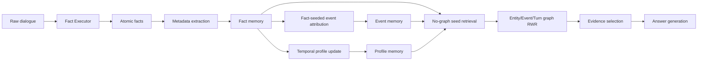

# AtomMem

AtomMem is a long-term memory system for personalized LLM agents. It organizes dialogue history around atomic facts, incrementally builds event memories and temporal user profiles, and retrieves answer evidence through an associative memory graph over entities, events, and neighboring turns.

The repository is arranged as a clean public release. It includes raw
conversation samples and runnable code, but it does **not** include generated
memory snapshots such as `facts_*.json`, `events_*.json`, or `profiles_*.json`.

## What AtomMem Builds

AtomMem starts from extracted atomic facts and then constructs three memory
views:

1. **Atomic Fact Memory** stores complete, standalone facts with metadata:
   people, entity-like keywords, event time, recorded time, source dialogue ID,
   and embedding.
2. **Event Memory** groups facts that describe the same occurrence. The public
   pipeline uses fact-seeded event-level attribution: each incoming fact first
   retrieves similar facts, converts them into existing-event or singleton-fact
   candidates, and lets an LLM decide whether to join or create events.
3. **Temporal Profile Memory** maintains long-term personal attributes and
   preferences as versioned profiles with `valid_from` and `history`, allowing
   newer evidence to confirm, refine, or update earlier user states.

At QA time, AtomMem first retrieves a small no-graph seed set, then activates a
localized fact graph and performs Random Walk with Restart, equivalently
personalized PageRank on the query-specific seed distribution.



## Repository Layout

```text
.
├── atommem_core/              # Public pipeline components
├── data/
│   ├── split_samples/         # Raw conversation and QA samples
│   └── fact_executor_sft/     # Place Fact Executor SFT data here before release
├── prompts/                   # LLM prompts used by memory construction and QA
├── scripts/
│   └── run_atommem_pipeline.py
├── src/                       # Core storage, retrieval, LLM, and embedding modules
├── config.py                  # Environment-driven configuration, no API key
├── .env.example
└── requirements.txt
```

## Installation

```bash
python -m venv .venv
source .venv/bin/activate
pip install -r requirements.txt
```

On Windows PowerShell:

```powershell
python -m venv .venv
.\.venv\Scripts\Activate.ps1
pip install -r requirements.txt
```

Then configure an OpenAI-compatible endpoint:

```bash
cp .env.example .env
```

Edit `.env`:

```bash
ATOMMEM_API_KEY=your_api_key_here
ATOMMEM_API_BASE=https://api.openai.com/v1
ATOMMEM_LLM_MODEL=gpt-4o-mini
ATOMMEM_EMBEDDING_MODEL=all-MiniLM-L6-v2
```

If the Fact Executor uses a different endpoint, also set:

```bash
ATOMMEM_FACT_EXECUTOR_API_KEY=your_fact_executor_key
ATOMMEM_FACT_EXECUTOR_API_BASE=https://your-fact-executor-endpoint/v1
ATOMMEM_FACT_EXECUTOR_MODEL=your_fact_executor_model
```

## Quick Checks

Validate that the command and paths are correct without model calls:

```bash
python scripts/run_atommem_pipeline.py \
  --conv-id sample-memory \
  --data-file data/<dataset>/<sample_id>.json \
  --output-dir runs/sample-memory \
  --dry-run
```

For a no-download smoke test of object initialization only, set:

```bash
ATOMMEM_DRY_RUN_EMBEDDING=1
```

Do not use `ATOMMEM_DRY_RUN_EMBEDDING=1` for real experiments.

## Running AtomMem

### Option A: Start From Fact Executor Output

This is the recommended research setting. Provide a pre-extracted facts file
with the format described in `data/fact_executor_sft/README.md`.

```bash
python scripts/run_atommem_pipeline.py \
  --conv-id sample-memory \
  --data-file data/<dataset>/<sample_id>.json \
  --facts-file path/to/preextracted_facts.json \
  --output-dir runs/sample-memory
```

### Option B: Extract Facts From Raw Dialogue

This mode calls the configured Fact Executor endpoint first and then builds the
AtomMem memory.

```bash
python scripts/run_atommem_pipeline.py \
  --conv-id sample-memory \
  --data-file data/<dataset>/<sample_id>.json \
  --extract-facts \
  --output-dir runs/sample-memory
```

### Useful Flags

```bash
# Build memory only
python scripts/run_atommem_pipeline.py ... --skip-qa

# Reuse an existing memory directory for QA only
python scripts/run_atommem_pipeline.py ... --skip-build

# Disable graph retrieval for ablation
python scripts/run_atommem_pipeline.py ... --disable-graph

# Send retrieved facts/profiles directly to answer generation
python scripts/run_atommem_pipeline.py ... --disable-evidence-summary
```

Generated outputs are written under `runs/` by default and are ignored by Git.

## Memory Construction

For each incoming atomic fact, AtomMem performs:

1. **Metadata extraction**
   - people
   - normalized entity-like keywords
   - event time and recorded time
   - whether the fact should contribute to profile extraction

2. **Deduplication and conflict handling**
   - duplicate threshold: `0.95`
   - conflict candidates are filtered by person overlap and semantic similarity,
     then judged by an LLM.

3. **Fact-seeded event-level attribution**
   - retrieve top `K_E = 10` similar facts using:

     \[
     S(F_i, F_j) =
     0.7 \cdot \operatorname{sim}_{emb}(F_i, F_j)
     + 0.3 \cdot \operatorname{Jaccard}(K_i, K_j)
     \]

   - only facts with overlapping people are used as event-attribution seeds.
   - facts already in events are converted to deduplicated event candidates.
   - facts without event membership are treated as singleton-fact candidates.
   - the LLM may select multiple existing events and multiple singleton facts.
   - selecting an existing event adds the new fact to that event and updates the
     event summary.
   - selecting a singleton fact creates a new event containing the new fact and
     that singleton fact.

4. **Incremental temporal profile update**
   - profile extraction is triggered every `10` pending profile-worthy facts.
   - retrieved candidate profiles are judged by an LLM using actions:
     `confirm`, `update_current`, `update_history`, or `new`.
   - each profile stores:
     - `profile_id`
     - `person`
     - `content`
     - `keywords`
     - `evidence`
     - `valid_from`
     - `history`, where each version has `version_id`, `content`,
       `valid_from`, `valid_to`, and `evidence`.

## Graph Retrieval

AtomMem uses a graph over fact nodes. Profiles are retrieved separately and are
not graph nodes.

### Seed Retrieval

The seed set is produced by no-graph layered retrieval:

- main fact recall: top `5`
- event-compensated recall: top `5`
- seed count: `k_s = 10`

The base fact/event score uses:

\[
S_{hybrid}=0.7 \cdot S_{embedding}+0.3 \cdot S_{keyword}
\]

Compensatory recall combines event relevance and fact self relevance:

\[
S_{fusion}(F)=0.7 \cdot S_{hybrid}(E,Q)+0.3 \cdot S_{hybrid}(F,Q)
\]

### Edge Channels

The final public graph uses three channels:

1. **Entity keyword edges**
   - connect facts sharing normalized keywords.
   - if both facts have non-empty people sets and the sets do not intersect,
     the keyword edge is rejected.

2. **Event edges**
   - connect facts belonging to the same event.
   - no extra person gate is applied because event construction already uses
     person-aware attribution.
   - event size penalty:

     \[
     w_{event}(e)=\frac{1}{(|e|-1)^{1.25}}
     \]

3. **Turn-neighborhood edges**
   - connect facts from nearby dialogue turns in the same session.
   - turn distance weight:

     \[
     w_{turn}(i,j)=\exp(-d(i,j)/2.0)
     \]

### Keyword Edge Weight

For a keyword \(k\):

\[
idf(k)=\log\frac{N+1}{df(k)+1}
\]

\[
penalty_q(k)=\max\left(0.45,\left(\frac{0.05}{\max(df\_ratio(k),0.05)}\right)^{0.7}\right)
\]

\[
penalty_{nq}(k)=\left(\frac{0.10}{\max(df\_ratio(k),0.10)}\right)^{1.0}
\]

\[
w(k)=idf(k)\cdot boost(k)\cdot penalty(k)
\]

where `boost(k)=2.5` for query keywords and `1.0` otherwise.

For facts \(F_i,F_j\), keyword edge weight is normalized:

\[
w_{kw}(F_i,F_j)=
\frac{\sum_{k\in K_i\cap K_j} w(k)}
{\sqrt{\sum_{k\in K_i}w(k)\cdot \sum_{k\in K_j}w(k)+10^{-8}}}
\]

### Random Walk With Restart

AtomMem builds a localized graph around the seed facts and runs RWR/PPR:

\[
\mathbf{p}^{(t+1)}
= r\mathbf{s} + (1-r)\mathbf{P}^{T}\mathbf{p}^{(t)}
\]

with restart probability \(r=0.34\). The transition matrix is a channel
mixture:

\[
P(i\rightarrow j)
=0.45P_{kw}(i\rightarrow j)
+0.40P_{event}(i\rightarrow j)
+0.15P_{turn}(i\rightarrow j)
\]

Each active channel is internally normalized before mixture. The final answer
context uses the top `k_f = 10` facts by graph activation score.

### Tuned Hyperparameters

| Group | Hyperparameter | Value |
|---|---:|---:|
| Base retrieval | main fact top-k | 5 |
| Base retrieval | event recall top-k | 5 |
| Base retrieval | compensation fact top-k | 5 |
| Base retrieval | profile top-k | 5 |
| Similarity | embedding weight | 0.7 |
| Similarity | keyword weight | 0.3 |
| Compensation | event weight | 0.7 |
| Compensation | fact weight | 0.3 |
| Graph mixture | keyword channel \(\rho_{kw}\) | 0.45 |
| Graph mixture | event channel \(\rho_{event}\) | 0.40 |
| Graph mixture | turn channel \(\rho_{turn}\) | 0.15 |
| Graph RWR | restart probability | 0.34 |
| Graph RWR | max iterations | 20 |
| Graph RWR | tolerance | 1e-6 |
| Graph locality | max seed facts | 10 |
| Graph locality | max hops | 2 |
| Graph locality | max local nodes | 180 |
| Graph locality | max neighbors per fact | 30 |
| Event channel | event size penalty alpha | 1.25 |
| Event channel | max event size | 60 |
| Event channel | max event neighbors/fact | 10 |
| Turn channel | turn window | 2 |
| Turn channel | turn decay tau | 2.0 |
| Turn channel | max turn neighbors/fact | 6 |
| Seed scoring | seed score power | 5.0 |
| Final context | final fact top-k | 10 |

## QA Outputs

For each QA item, AtomMem records:

- generated answer
- query intent
- selected evidence
- retrieved fact IDs and source dialogue IDs
- latency breakdown
- evidence summary and graph debug information

The script also prints aggregate LLM call counts and total token usage.

## LoCoMo Benchmark

If the repository includes LoCoMo raw samples under `data/split_samples/` and
pre-extracted Fact Executor outputs under `output/facts_conv-*-end.json`, run:

```bash
python scripts/evaluate_locomo.py
```

The script builds one independent AtomMem memory per conversation, evaluates
categories 1-4 by default, and writes per-question predictions plus category
statistics for F1, BLEU-1, Recall@10, LLM-as-a-Judge accuracy (`J`), and total
token usage under `runs/locomo_eval/`.

## Notes for Public Release

- Add the Fact Executor SFT data under `data/fact_executor_sft/` before pushing.
- Do not commit files under `runs/`, `outputs/`, `reports/`, or constructed
  memory snapshots such as generated `facts/events/profiles` files from a run.
- Pre-extracted Fact Executor outputs under `output/` are benchmark inputs when
  you choose to publish the LoCoMo evaluation setup.
- `config.py` contains no API key. All credentials should be supplied through
  environment variables or `.env`.
